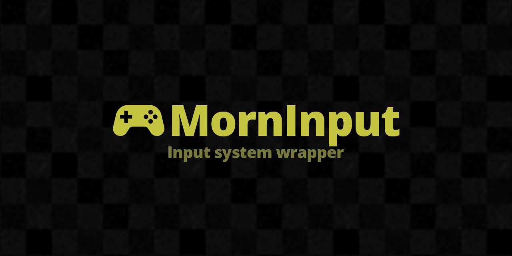

# MornInput

<p align="center">
  
</p>

<p align="center">
  
</p>

## 概要

Unity Input System のラッパー。マルチプレイヤー入力管理・スキーム切替検知・入力アイコン表示などを統一化する。

## 導入方法

Unity Package Manager で以下の Git URL を追加:

```
https://github.com/TsukumiStudio/MornInput.git?path=src#1.0.0
```

`Window > Package Manager > + > Add package from git URL...` に貼り付けてください。

### 依存パッケージ

- [Unity Input System](https://docs.unity3d.com/Packages/com.unity.inputsystem@latest) (`com.unity.inputsystem`)
- [UniRx](https://github.com/neuecc/UniRx) (`com.neuecc.unirx`)
- [VContainer](https://github.com/hadashiA/VContainer) (`jp.hadashikick.vcontainer`)
- [MornGlobal](https://github.com/TsukumiStudio/MornGlobal) (`com.tsukumistudio.mornglobal`)

## ライセンス

[The Unlicense](LICENSE)
